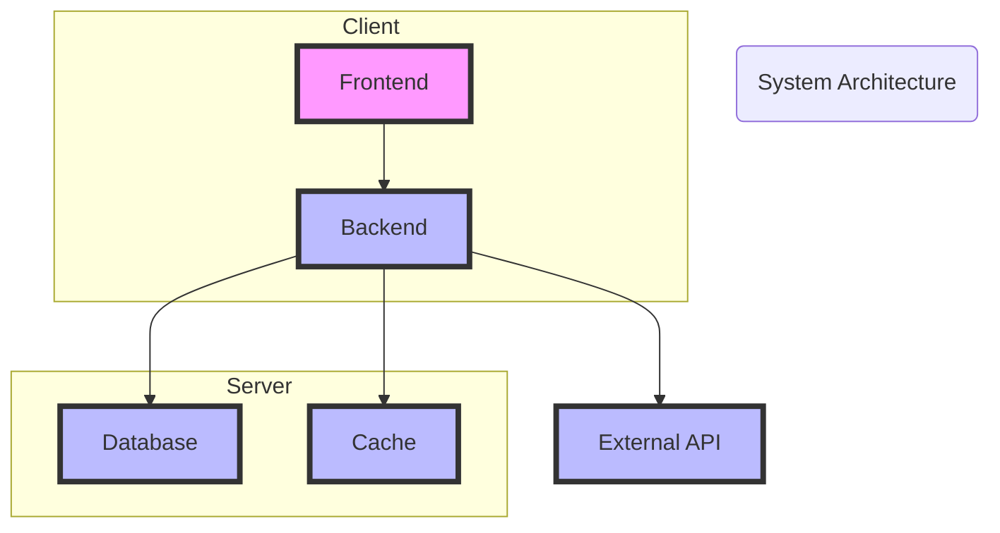
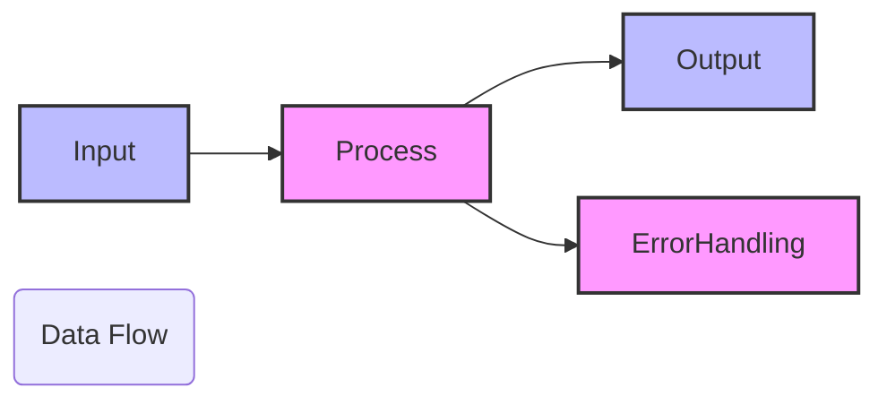
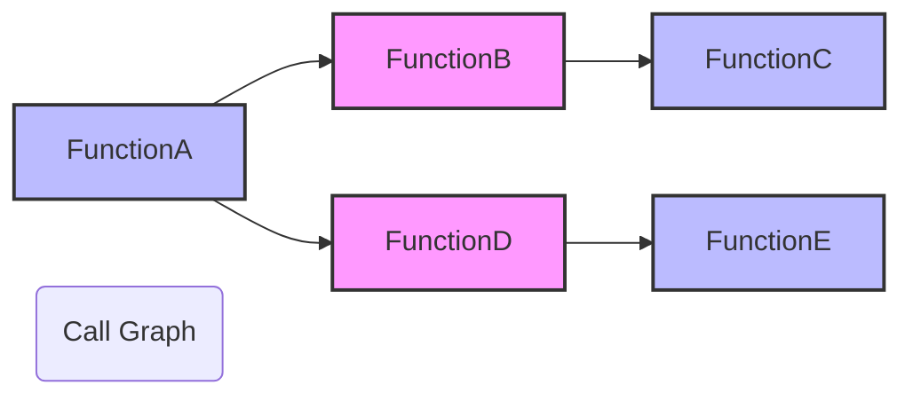

# Deep Wiki for Project Code Snippets

## Project Overview
This document provides a comprehensive overview and detailed explanations of the code snippets found within this project. It covers various coding patterns, conventions, algorithms, APIs, design patterns, domain entities, error handling mechanisms, logging practices, and more that are demonstrated within the project code snippets.

## Major Concepts

### Algorithms

### APIs

### Design Patterns

### Domain Entities

### Error Handling

### Logging

## Mermaid Diagrams

### System Architecture Diagram


### Data Flow Diagram


### Call Graph Diagram


## Snippet Catalog

| Snippet ID | Language | Purpose |
|------------|----------|---------|
| 1          | Python   | Example of using AI service APIs |
| 2          | JavaScript | Demonstration of error handling in async operations |

## Walkthroughs

### Using AI Service APIs

1. **Import required modules**: Import the necessary library to interact with AI service.
    ```python
    import ai_service
    ```
   
2. **Initialize service client**: Set up the client using authentication credentials.
    ```python
    client = ai_service.Client(api_key='your_api_key')
    ```

3. **Make API request**: Perform an API call to retrieve data or perform actions.
    ```python
    response = client.get_data(parameters)
    ```

4. **Handle response**: Process the response received from the API.
    ```python
    if response.status_code == 200:
        data = response.json()
    else:
        raise Exception("API call failed")
    ```

### Error Handling in Asynchronous Operations

1. **Try-Catch block**: Use try-catch to manage potential errors during asynchronous calls.
    ```javascript
    try {
        const data = await asyncOperation();
    } catch (error) {
        console.error("Error occurred:", error);
    }
    ```

2. **Logging**: Log the errors and important events for later analysis.
    ```javascript
    console.log("Operation started");
    console.error("An error occurred:", error);
    ```

## Best Practices

- Always validate input data before processing it.
- Use environment variables for configurations instead of hard-coding them.
- Implement comprehensive logging to capture and analyze errors and system events.
- Ensure error handling covers all potential failure points in asynchronous operations.

## Anti-Patterns

- Avoid using global variables for managing states.
- Do not ignore caught exceptions; log them or handle them appropriately.
- Prevent mixing business logic with presentation logic in the same function.

## Open TODOs

- Implement unit tests for all critical functions.
- Refactor existing code to improve modularity and readability.
- Update the API authentication method to use OAuth for enhanced security.

## Further Reading

- [PEP 8 -- Style Guide for Python Code](https://www.python.org/dev/peps/pep-0008/)
- [JavaScript Promises: An Introduction](https://developers.google.com/web/fundamentals/primers/promises)
- [Design Patterns: Elements of Reusable Object-Oriented Software](https://www.amazon.com/Design-Patterns-Elements-Reusable-Object-Oriented/dp/0201633612)

This document serves as a detailed guideline for developers who interact with the code snippets within this project, offering a thorough understanding of the underlying practices and helping maintain efficient coding standards.